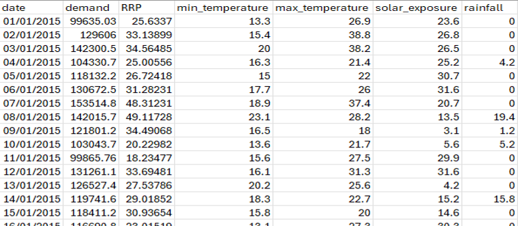
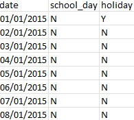

<h1>Analysing an energy dataset</h1>

<h2>Description</h2>
AusEnergy has provided a dataset named energy_demand.csv containing daily records of electricity demand, recommended retail prices, and weather conditions from 2015 to 2020. The dataset includes columns for the date, total daily electricity demand (in MWh), recommended retail price (in AUD$ / MWh), minimum and maximum temperatures (in Celsius), total daily sunlight energy (in MJ/m^2), and daily rainfall (in mm). <br> 

<br> Their request is to analyze the impact of holidays and school days on electricity demand, analyze the impact of weather on demand. Summarize the trends of demand over time.

<h2>Software and Languages Used </h2>

- Microsoft Excel
- Microsoft Excel associated formulas and functions  

<h2>Environments Used </h2>

- <b>Windows 11</b> 

<h2>Data Recieved</h2>
<h3>Here are the columns and their definitions:</h3>

- <strong>Date:</strong> datetime, the date of the recording.
- <strong>Demand:</strong> float, a recommended retail price in AUD$/MWh.
- <strong>RRP:</strong>float, the total daily electricity demand in MWh.
- <strong>Max_temperature:</strong> float, the maximum temperature during the day in celsius.
- <strong>Solar_exposure:</strong>float, the total daily sunlight energy in MJ/m^2.
- <strong>Rainfall:</strong> float, the daily rainfall in mm.

<h3>An example of the data:</h3>


<h2>Walk-through:</h2>
<h3>Finding and loading the data<h3>

After conducting research online, data on school holidays in Australia from 2015 to 2020 was gathered and organized. Below is an example of the collected data.
<br>
<br>
<br>
<h3>Breaking the Date Column into Components</h3>
After the data was loaded togther the next step was breaking the date column into year, month of year, week of year and day of the week.
This used the TEXT function of Excel:

```bash
=TEXT([@Date],"dddd") #for day of the week
=TEXT([@Date],"mmmm") #for month in the year
=TEXT([@Date],"yyyy") #for year 
```
To find the week of year required a different function WEEKNUM was used:

```bash
=IF(CELL("format",[@Date])="D1", WEEKNUM([@Date], 2), [@Date])
```

<h4>Components explained</h4>

- IF(condition, value_if_true, value_if_false)
  * The IF function checks whether a condition is met and returns one value if true and another value if false.
 
- CELL("format", [@Date])="D1"
  * This part of the formula uses the CELL function to get the format of the cell
  * "D1" is a specific format code that represents a date format.
  * The condition checks if the format code of A345 is equal to "D1".
 
- WEEKNUM([@Date], 2)
  * If the condition is true (i.e., A345 is in date format "D1"), the formula returns the week number of the date in A345.
  * WEEKNUM(A345, 2) calculates the week number of the year for the date in A345, with weeks starting on Monday (2).
 
- [@Date]
  * If the condition is false, it returns the original value!


